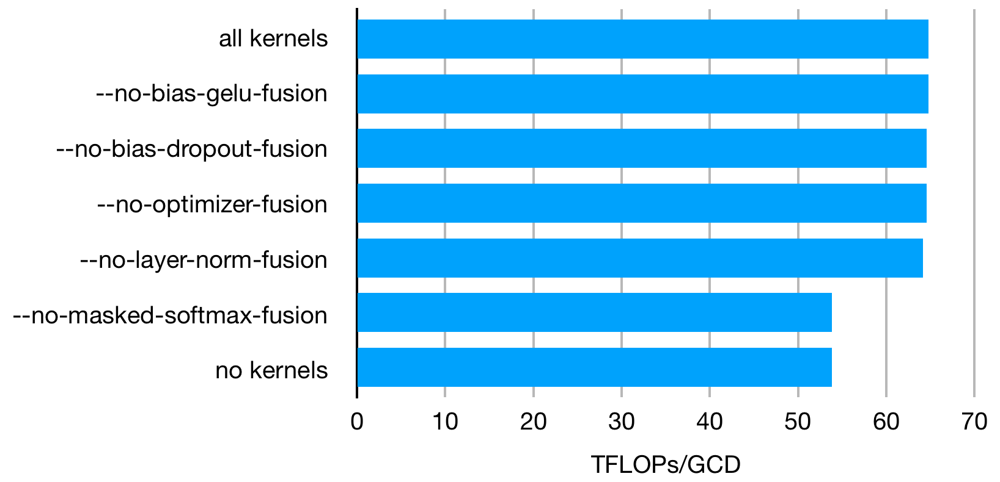

# LUMI LLM scaling

Scripts and documentation on scaling large language model training on the [LUMI supercomputer](https://www.lumi-supercomputer.eu/).

## Data

Some example datasets that can be used for the experiments can be found
in <https://a3s.fi/lumi-llm-scaling/index.html>.

For data storage, as the home directory disk size quota on the system
is limited to just 20GB, you may want to use one of the other
[storage options](https://docs.lumi-supercomputer.eu/storage/).
The simplest option is to set up everything in the project
scratch directory `/scratch/<project>`. For example, if you are a
member of project 462000273, you can create a directory for your work
in project scratch with

```
mkdir /scratch/project_462000273/$USER
cd /scratch/project_462000273/$USER
```

and work there.

## Quickstart

To get started training with one of the transformer implementations, see
instructions in the relevant subdirectory:

* [Megatron-DeepSpeed](meg-ds)
* [BigCode Megatron-LM](bc-meg-lm)
* [GPT-NeoX](gpt-neox)
* (others TODO)

## Results

### Impact of fused kernels

The figure below shows the impact of switching off one or more of the Megatron-DeepSpeed fused kernels on throughput. In brief summary, only the fused masked softmax kernel has a clear impact on throughput in this experiment.



### Impact of --num-workers

A non-zero number of dataloader workers provided an approximately 2% increase in throughput in an experiment using the 33B setup, 32 nodes (256 GCDs), data on scratch (flash had issues at the time)

```
num-workers	samples/sec	TFLOPs
0           22.1        48.4
1           22.7        49.7
2           22.7        49.6
4           22.8        49.8
```
